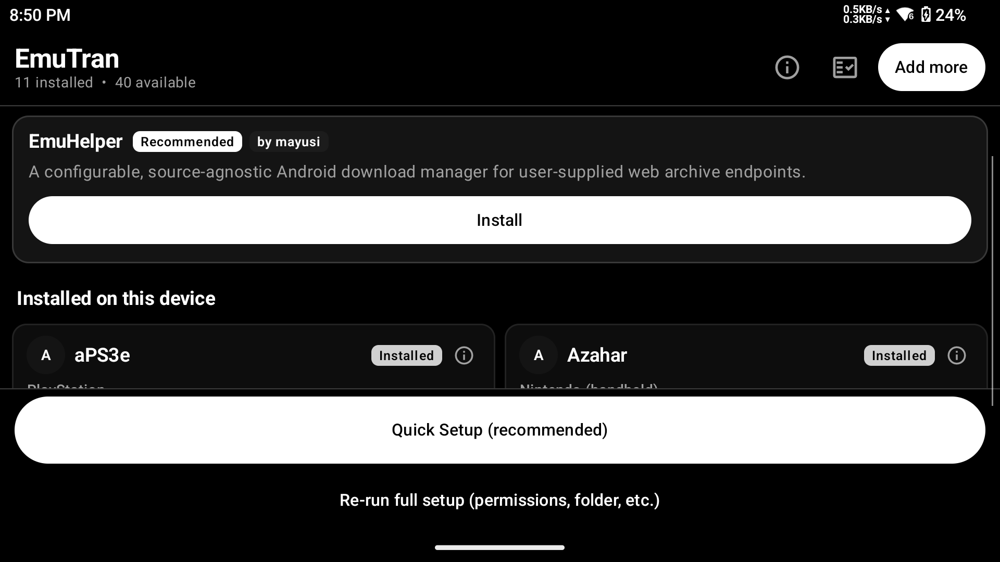
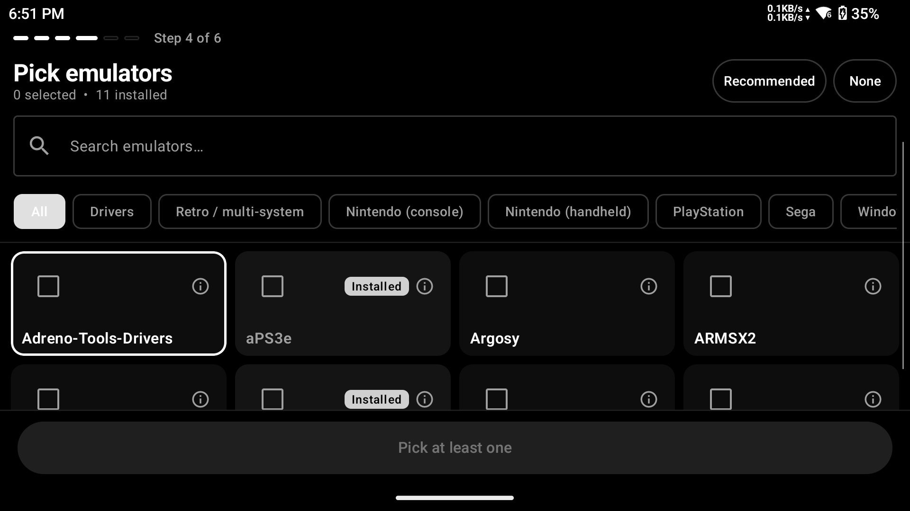
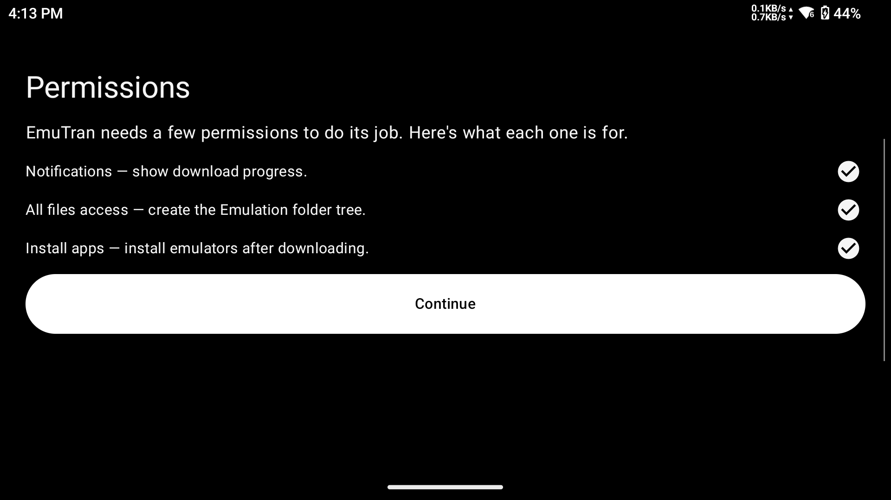

[//]: # (Optional: place a logo image here once one exists)
[//]: # (

)

# EmuTran

**One-tap emulation setup for Android handhelds.**

EmuTran turns the tedious, multi-hour job of setting up an Android gaming handheld into a single guided flow. It identifies your device, lets you pick your emulators from a curated catalog, downloads them from their official source repositories, installs them silently (or with standard prompts if Shizuku is unavailable), and creates the full Emulation folder tree — all in one go. Built for Retroid Pocket, AYN Odin, and Anbernic owners who want a clean setup without the forum archaeology.

  
  
  

---

## What it does

- **Identifies your device** — detects manufacturer, SoC, and screen type to surface relevant emulators and skip ones that don't apply to your hardware.
- **Curated emulator catalog** — backed by the [Obtainium-Emulation-Pack](https://github.com/RJNY/Obtainium-Emulation-Pack) manifest; covers 40+ emulators across Nintendo, PlayStation, Sega, retro multi-system, and more.
- **Batch silent install** — integrates with [Shizuku](https://github.com/RikkaApps/Shizuku) for fully silent installation without an Android prompt per app. Falls back gracefully to standard installer dialogs if Shizuku is not available.
- **Emulation folder scaffold** — creates the complete `/Emulation/` directory tree with BIOS subfolders and a README in each one explaining what belongs there. No BIOS files are provided or downloaded.
- **Optional GPU driver staging** — for Adreno devices (Retroid Pocket 6 and similar), can stage community Adreno drivers from [K11MCH1/AdrenoToolsDrivers](https://github.com/K11MCH1/AdrenoToolsDrivers) for emulators that support custom GPU drivers (Switch, PS Vita, etc.).
- **Management dashboard** — after first setup, the dashboard shows installed emulators, available updates, and lets you add more from the catalog at any time without re-running the full wizard.
- **In-app updates** — EmuTran checks for new versions of itself in the background (every 24 hours, on Wi-Fi, battery not low) and prompts you when one is available. Downloads and triggers the system installer for you.

---

## What it does NOT do

Being clear about scope builds trust:

- **Does not download ROMs, ISOs, or game files** of any kind.
- **Does not provide BIOS files.** It creates the BIOS folder structure and leaves a README in each folder noting what goes there — you supply the files yourself from your own hardware.
- **Does not modify system files or require root.** All actions are user-space. Shizuku is optional and only used to skip per-install dialogs.
- **Does not collect analytics, telemetry, or usage data.** EmuTran makes no tracking calls of any kind. Network activity is limited to: fetching the emulator manifest, downloading emulator APKs from their official release pages, downloading GPU driver ZIPs from the official Adreno Tools repo, and checking the EmuTran GitHub release API for self-updates.
- **Does not auto-install anything without your confirmation.** The Quick Setup one-tap installs the recommended set you approved in the picker, and you can cancel before any download starts.

---

## Supported devices

| Device | Status | Notes |
|---|---|---|
| Retroid Pocket 6 (SD 8 Gen 2 / Adreno 740) | Tested | Primary dev device. GPU driver staging supported. |
| Retroid Pocket 4 / 4 Pro / 5 | Expected | ARM64, Android 13. GPU driver staging supported on Adreno models. |
| AYN Odin 2 / Odin 3 | Expected | ARM64, Android 13. GPU driver staging supported. |
| Anbernic RG-series (Android, ARM64) | Expected | Android 10+ ARM64 variants should work. |
| Any ARM64 Android 10+ handheld | Should work | If you run into issues, open an issue with your device info. |

**Requirements:** ARM64 processor · Android 10 (API 29) or later.

GPU driver staging is Adreno-only (Qualcomm GPUs). Mali/Dimensity devices install fine; driver staging step is skipped automatically.

---

## Install

1. Go to the [**Releases**](https://github.com/mayusi/EmuTran/releases/latest) page and download the latest `.apk` file.
2. Transfer the APK to your handheld (or open the Releases page directly in its browser) and tap to install. You may need to allow installs from your browser or file manager — Android will prompt you once.
3. Open EmuTran and follow the permissions wizard. It will ask for three things:
   - **Notifications** — to show download progress in the notification bar.
   - **All files access** — to create the Emulation folder tree on your storage.
   - **Install unknown apps** — to install the emulator APKs after downloading.
4. Pick your emulators, choose a storage location, and tap Install.

No account required. No telemetry. No subscription.

---

## Credits

- **[Obtainium-Emulation-Pack](https://github.com/RJNY/Obtainium-Emulation-Pack)** by RJNY — the emulator manifest and curation EmuTran builds on.
- **[Shizuku](https://github.com/RikkaApps/Shizuku)** by RikkaApps — the silent-install backbone when available.
- **[AdrenoToolsDrivers](https://github.com/K11MCH1/AdrenoToolsDrivers)** by K11MCH1 — the community Adreno GPU driver repository.

---

## License

[MIT](LICENSE) — © mayusi
